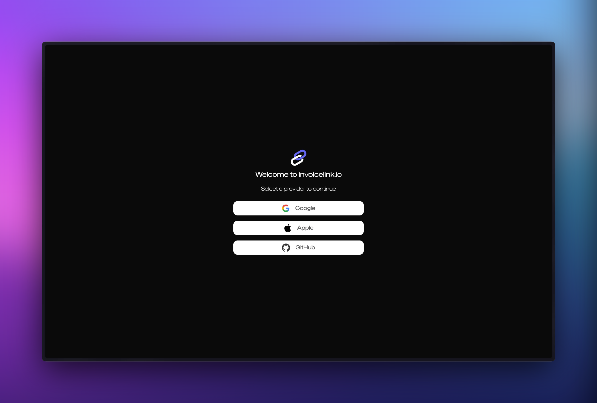

To create an account, visit [invoicelink.io](https://invoicelink.io) and click on the **Get Started** button in the top right corner of the page.

In order you create an account, you will need to use one of the supported social providers. Currently, we support Google, Apple and Github.