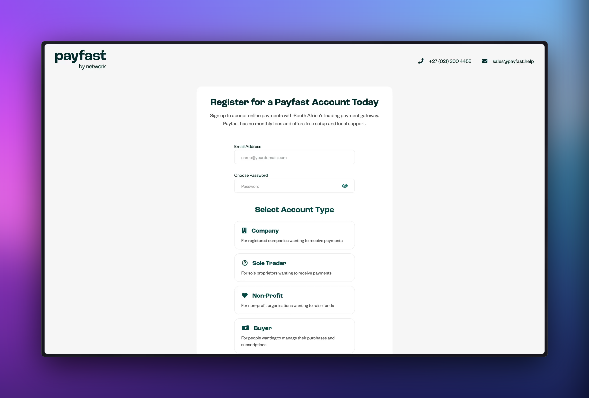
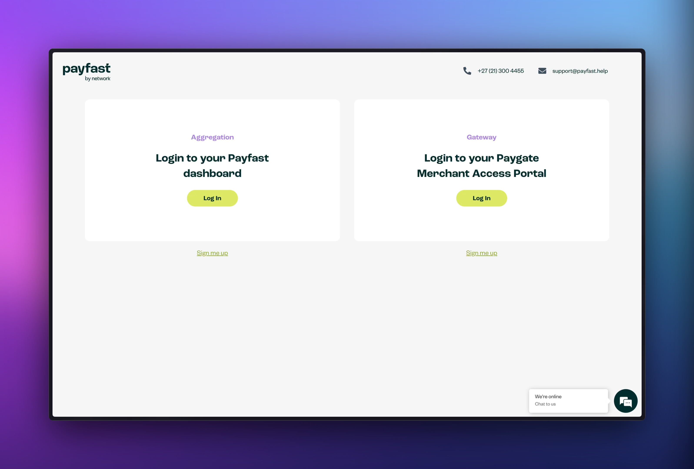
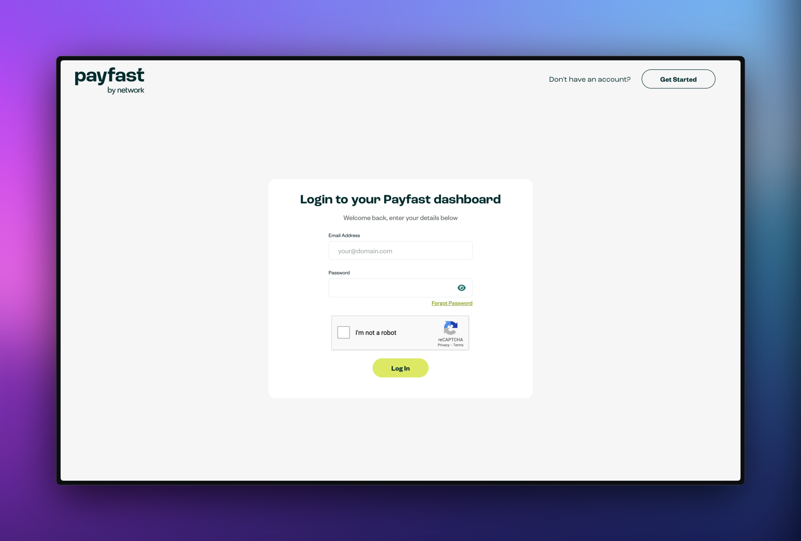
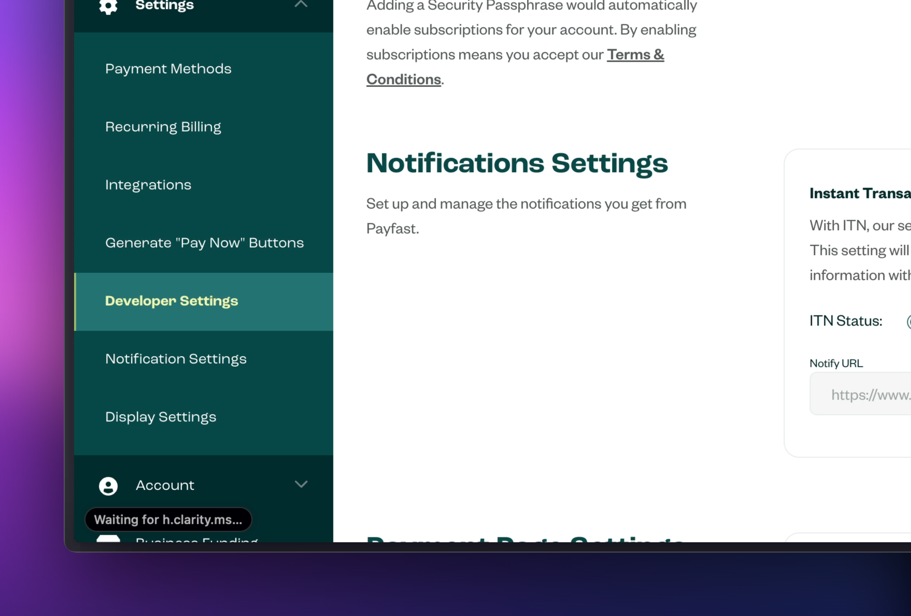
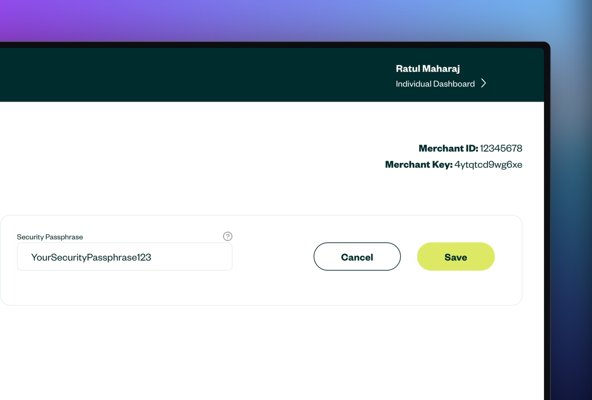
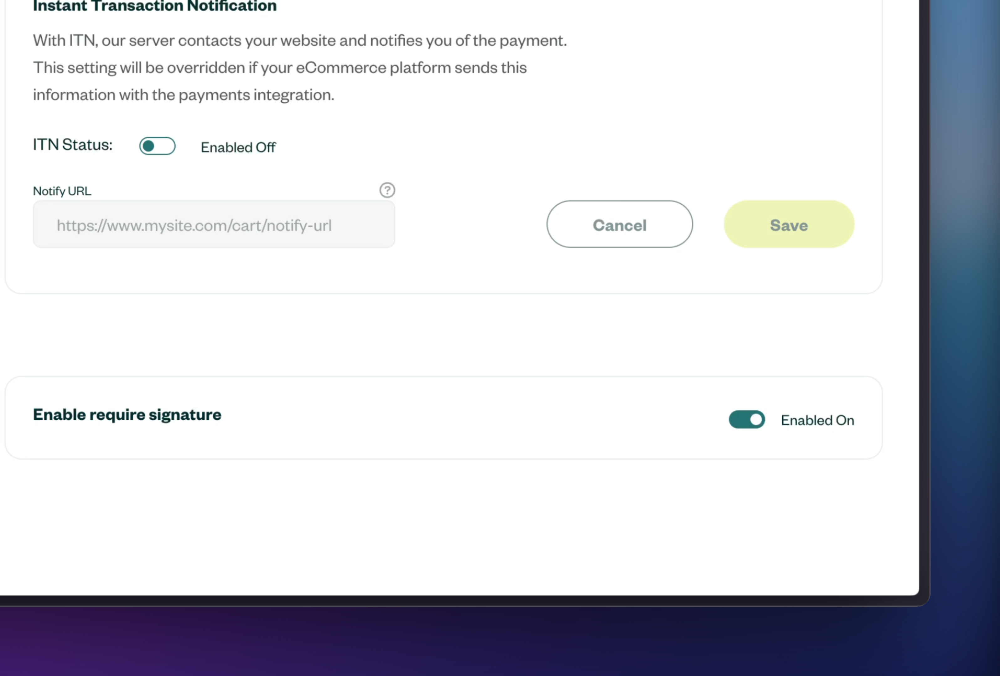
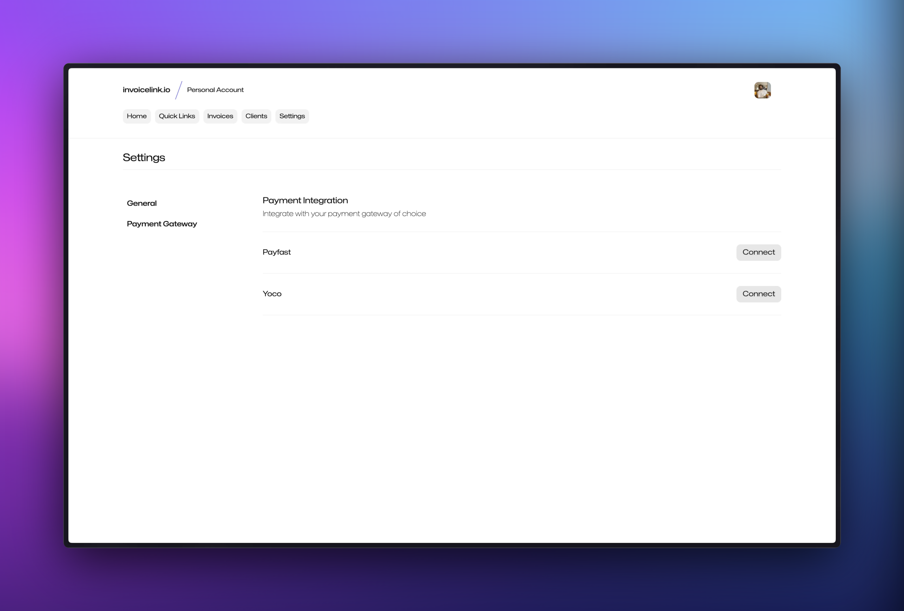
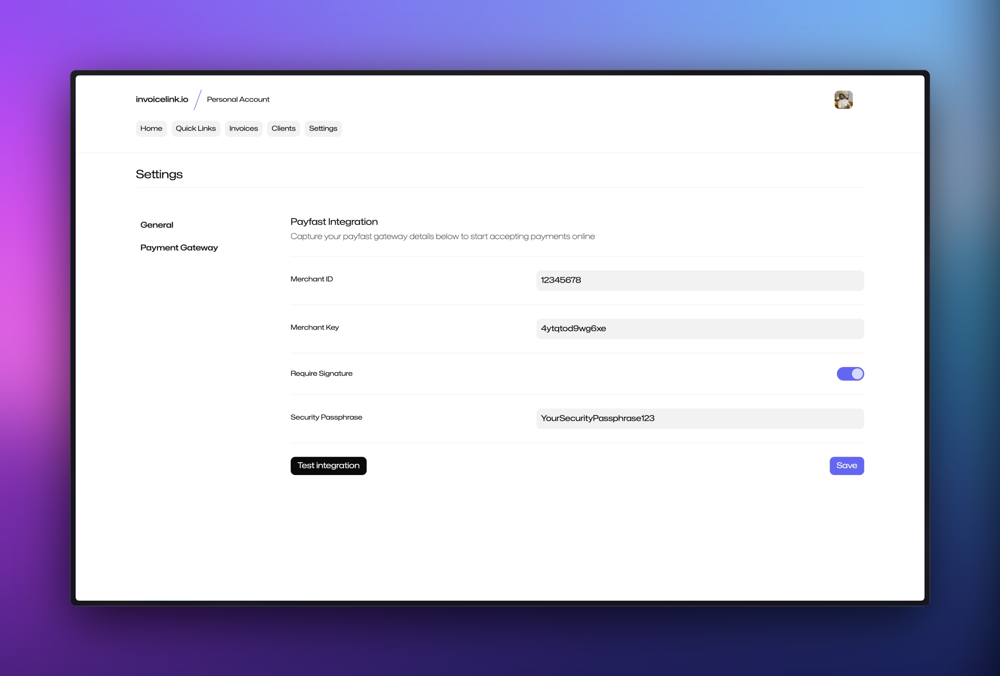

## Create a Payfast account

Before you can start using the Payfast integration with invoicelink, you need to create a Payfast account. You can do so by visiting [registration.payfast.io](https://registration.payfast.io/) and following their process to register an account.

## Login to your Payfast account

Once you have created your Payfast account, you can login to your account by visiting [login.payfast.io](https://login.payfast.io/).

Select the `Aggregation` option on the left to login to your payfast account.

You can then proceed to login to your account using the credentials you created during the registration process.

## Get your merchant details

Once you have logged in to your Payfast account, you will need to retrieve your payfast Merchant ID and Merchant Key from the developer settings page. You can do so by clicking on `Settings` and then `Developer Settings` in the sidebar on the left.

Once you're on the developer settings page, you can take note of your `Merchant ID` and `Merchant Key` located at the top right of the page as well the `Security Passphrase` located just below. You will need these values when setting up the integration in invoicelink.

## Require signature

As shown above, Payfast allows you to set a passphrase to be used to create a signature to enable better security practices. We recommend that you keep this feature enabled.

## Set up the integration

Sign in to your invoicelink account and navigate to the [payment gateway settings page](https://app.invoicelink.io/settings/gateway). Click on the `Connect` button next to payfast.

You can then enter your payfast credentials which you [retrieved from your payfast account](#get-your-merchant-details) above and then click `Save` to set up the integration.

:::note
Ensure that the invoicelink `Require Signature` setting shown above matches the `Enable require signature` setting you have set in your [payfast account](#require-signature).
:::

## Test the integration

To test that everything is working as expected, you can click the `Test integration` button. If the integration is successful, you will be taken to the payfast payment page.
