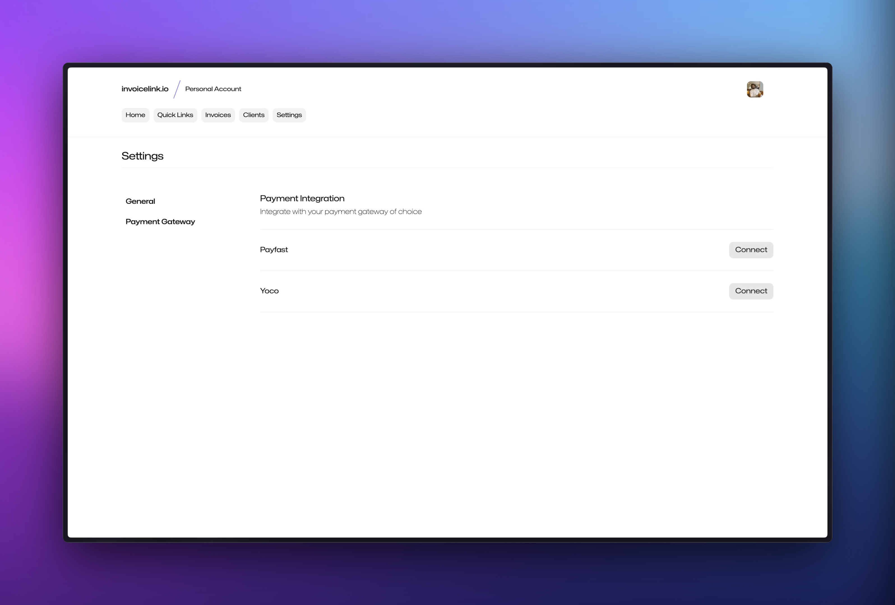

## Create a Yoco account

Before you can start using the Yoco integration with invoicelink, you need to create a Yoco merchant account. You can do so by visiting [yoco.com](https://hello.yoco.com/signup) and following their process to register an account.

## Login to your Yoco account

Once you have created your Yoco account, you can login to your account by visiting [portal.yoco.co.za](https://portal.yoco.co.za/account/login). You can proceed to login to your account using the credentials you created during the registration process.

## Get your Yoco credentials

Once you have logged in to your Yoco account, you will need to retrieve your live yoco public and secret keys from the payment gateway page. You can do so by clicking on `Sell Online` and then `Payment Gateway` in the sidebar on the left.

Once you're on the payment gateway page, you can scroll to the section labelled `Your keys`. Take note of your `LIVE PUBLIC KEY` and `LIVE SECRET KEY` located at the left of the page. You will need to provide these values when setting up the integration in invoicelink.

## Set up the integration

Sign in to your invoicelink account and navigate to the [payment gateway settings page](https://app.invoicelink.io/settings/gateway). Click on the `Connect` button next to Yoco.

You can then enter your yoco credentials which you [retrieved from your account](#get-your-yoco-credentials) above and then click `Save` to set up the integration.

## Test the integration

To test that everything is working as expected, you can click the `Test integration` button. If the integration is successful, you will be taken to the yoco payment page.
