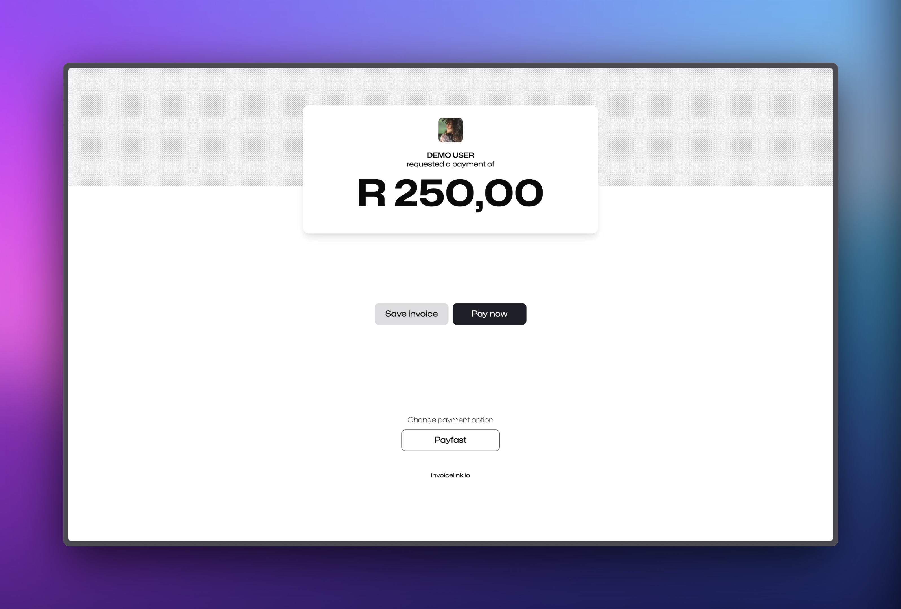

## What is invoicelink?

Invoicelink.io is proudly South African application developed to make it easy to get paid digitally. The core idea behind the platform is to combine the power of a payment gateway with the simplicity of a link.

## How does it work?

Users of the app can either create quick links or full invoices and send them to their clients via email or any other messaging platform using a generated link. Users have the option to add their banking details or connect a payment gateway account to their invoicelink account.

Clients that click on the link will be presented with a payment page as seen below.

Payments are processed by the payment gateway and the funds are deposited into the users merchant account.
